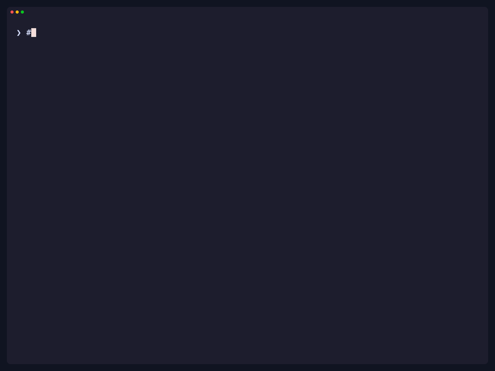

# x-digest

Read your X (Twitter) feed as terminal highlights, sorted by engagement. Use your existing browser login; no developer API key is required.

## Demo

[](docs/demo.mp4)

**[Watch/download the MP4](docs/demo.mp4)** · [Recording script](docs/demo.tape)

The recording executes live X requests using a local Google Chrome login. It shows five inputs: Following with an explicit profile, For You, `--user @karpathy`, `--bookmarks "claude"`, and a bookmark search with no matches. The displayed posts and engagement counts are real results from the recording session; they will change over time.

Run the same commands locally after signing into x.com in Chrome:

```bash
./x-digest --browser chrome --profile Default --count 2
./x-digest --browser chrome --timeline foryou --count 2
./x-digest --browser chrome --user @karpathy --count 2
./x-digest --browser chrome --bookmarks "claude" --count 1
./x-digest --browser chrome --bookmarks "x-digest-no-matching-bookmark-20260930"
```

## Build

Requires **Go 1.25+**.

```bash
git clone https://github.com/pscyk/x-digest.git
cd x-digest
make build
```

This produces `./x-digest` on macOS/Linux or `x-digest.exe` on Windows. You can also run `go install ./cmd/x-digest` from the checkout.

## Google Chrome on macOS

1. Log into **x.com in Google Chrome** on this Mac.
2. Run `./x-digest --browser chrome --count 5`.
3. If macOS asks, allow access to **Chrome Safe Storage** in your login Keychain.

The reader uses Chrome's last-used profile from `Local State`, falling back to `Default` when none is recorded. To choose a different account, open `chrome://version` in that Chrome profile and use the last directory of **Profile Path**:

```bash
./x-digest --browser chrome --profile "Default" --count 5
./x-digest --browser chrome --profile "Profile 1" --timeline foryou
```

`--profile` takes the directory name, not a display name or full path. The reader stays within that profile; it does not search other accounts. It uses the locally saved X session, so signing into Google Chrome alone is not enough.

Chrome support currently targets **macOS**, including current domain-bound encrypted cookies. Windows/Linux Chrome encryption is not implemented. Firefox remains the default browser; the existing Firefox reader uses the Windows `APPDATA/Mozilla/Firefox` profile layout.

## Usage

```bash
# Top 20 from your Following feed, using Chrome
./x-digest --browser chrome

# Top 10 from For You
./x-digest --browser chrome --timeline foryou --count 10

# Specific account (@ is optional)
./x-digest --browser chrome --user elonmusk
./x-digest --browser chrome --user @Polymarket --count 5

# Search your bookmarks
./x-digest --browser chrome --bookmarks "claude code"
./x-digest --browser chrome --bookmarks all --count 10

# Existing Firefox behavior
./x-digest --browser firefox --count 5
```

The live `--bookmarks all` option retains the existing broad search for `a`; it is **not a complete export of every bookmark**.

### Flags

| Flag | Default | Description |
|------|---------|-------------|
| `--browser` | `firefox` | Cookie source: `firefox` or `chrome` (macOS) |
| `--profile` | auto | Browser profile directory name; Chrome example: `Profile 1` |
| `--count` | `20` | Number of top tweets to show, from 1 to 100 |
| `--timeline` | `following` | `following` or `foryou` |
| `--user` | | Fetch tweets from a specific account |
| `--bookmarks` | | Search bookmarks by keyword, or use `all` for a broad search |
| `--query-id` | | Override the timeline GraphQL query ID |
| `--help` | | Show usage |

`--user` and `--bookmarks` are mutually exclusive. Invalid flags and counts are rejected before browser or Keychain access.

## How it works

1. Reads `auth_token` and `ct0` from the selected browser.
2. Sends them to X's internal GraphQL API at `x.com`, as session credentials.
3. Sorts returned tweets by likes + retweets.
4. Renders highlights with [Lip Gloss](https://github.com/charmbracelet/lipgloss).

Chrome's database is opened read-only in a SQLite transaction, including its active WAL. Only unexpired, unpartitioned X/Twitter session cookies at `/` are selected. The macOS Keychain secret is captured in memory and used to decrypt those cookies. Credentials are never printed or exported, and API redirects are not followed.

The encryption format follows Chromium's [macOS Keychain provider](https://chromium.googlesource.com/chromium/src/+/HEAD/components/os_crypt/async/browser/keychain_key_provider.mm) and [cookie database domain binding](https://chromium.googlesource.com/chromium/src/+/HEAD/net/extras/sqlite/sqlite_persistent_cookie_store.cc).

### Troubleshooting

- **No complete, unexpired X session:** sign into x.com in the selected Chrome profile. If Chrome has not flushed the login to disk yet, quit it normally and retry.
- **Cannot read Chrome Safe Storage:** unlock your login Keychain, allow the macOS access prompt, and retry.
- **Database locked:** quit Chrome normally, then retry.
- **HTTP 401/403:** refresh your X login in the selected browser.
- **HTTP 429:** wait before retrying.
- **HTTP 400/404 or Query not found:** X may have rotated its internal query IDs. Cookie extraction can succeed independently of the API request.

## Query ID rotation

X periodically rotates GraphQL query IDs. To update a timeline query:

1. Find X's current main JavaScript bundle from the x.com page source.
2. Find `operationName:"HomeLatestTimeline"` (Following) or `operationName:"HomeTimeline"` (For You) and its query ID.
3. Pass the ID with `--query-id <id>`, or update the constants in `internal/twitter/client.go`.

The override applies to timelines only. Account and bookmark query IDs are separate constants. The existing public web-client bearer token in `client.go` is not a personal credential.

## Verify and re-record

```bash
go test -race ./...
go vet ./...

# Optional: exercise malformed encrypted cookie inputs
go test ./internal/cookies -run '^$' -fuzz '^FuzzDecryptChromeCookie$' -fuzztime=5s

# Reproduce the video and animated README preview (VHS 0.10+)
brew install vhs ttyd ffmpeg
make demo
```

`make demo` executes the built binary against X and produces an MP4, GIF, poster, and terminal transcript. It requires an active Chrome X session and Keychain access. The tape waits for each request to finish before moving on. Review recordings before sharing: feeds and bookmark results belong to the selected account. Unit tests use synthetic cookie databases and independently generated encrypted test vectors; they do not read personal browser sessions.

## Project structure

```text
cmd/x-digest/       CLI flags and browser selection
internal/cookies/  Firefox and macOS Chrome session readers
internal/twitter/  API client, response parsing, types
internal/display/  Lip Gloss rendering and formatting
docs/              Demo video, preview, and reproducible VHS tape
```
